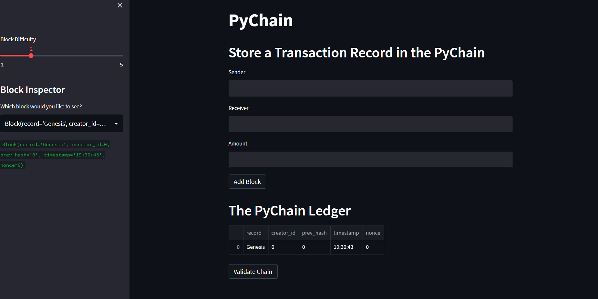
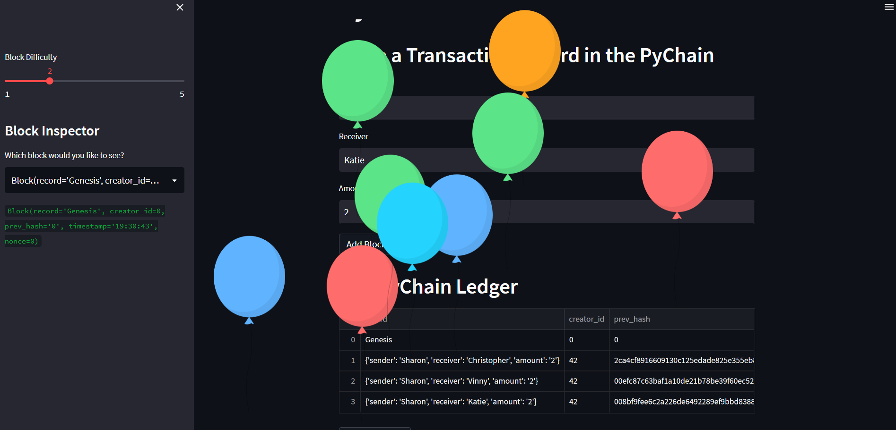
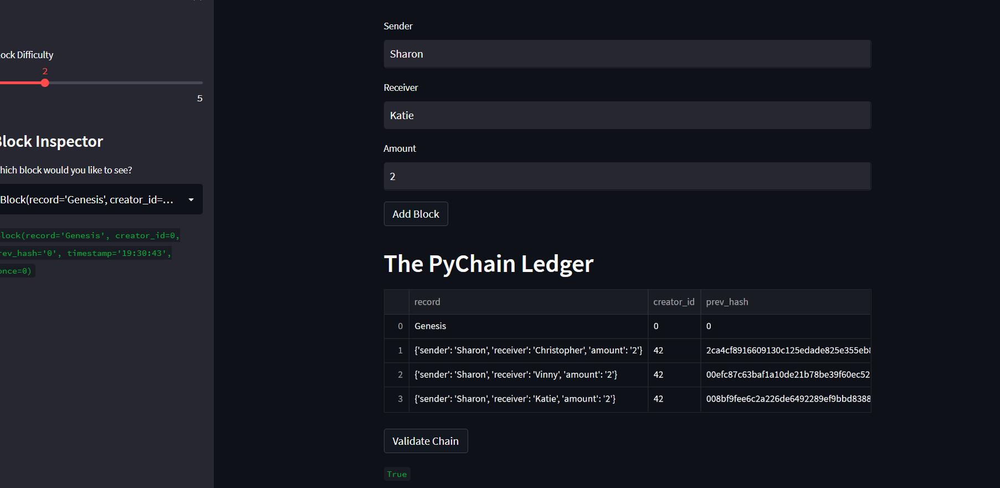

# PyChain Ledger

################################################################################

# You’ll make the following updates to the provided Python file for this

# Challenge, which already contains the basic `PyChain` ledger structure that

# you created throughout the module:

# Step 1: Create a Record Data Class

# * Create a new data class named `Record`. This class will serve as the

# blueprint for the financial transaction records that the blocks of the ledger

# will store.

# Step 2: Modify the Existing Block Data Class to Store Record Data

# * Change the existing `Block` data class by replacing the generic `data`

# attribute with a `record` attribute that’s of type `Record`.

# Step 3: Add Relevant User Inputs to the Streamlit Interface

# * Create additional user input areas in the Streamlit application. These

# input areas should collect the relevant information for each financial record

# that you’ll store in the `PyChain` ledger.

# Step 4: Test the PyChain Ledger by Storing Records

# * Test your complete `PyChain` ledger.

################################################################################

# Imports

import streamlit as st

from dataclasses import dataclass

from typing import Any, List

import datetime as datetime

import pandas as pd

import hashlib

from sympy import re

################################################################################

# Step 1:

# Create a Record Data Class

# Define a new Python data class named `Record`. Give this new class a

# formalized data structure that consists of the `sender`, `receiver`, and

# `amount` attributes. To do so, complete the following steps:

# 1. Define a new class named `Record`.

# 2. Add the `@dataclass` decorator immediately before the `Record` class

# definition.

# 3. Add an attribute named `sender` of type `str`.

# 4. Add an attribute named `receiver` of type `str`.

# 5. Add an attribute named `amount` of type `float`.

# Note that you’ll use this new `Record` class as the data type of your `record` attribute in the next section.

# @TODO

# Create a Record Data Class that consists of the `sender`, `receiver`, and

# `amount` attributes

# YOUR CODE HERE

@dataclass

class Record:

    sender: str

    receiver: str

    amount: float

################################################################################

# Step 2:

# Modify the Existing Block Data Class to Store Record Data

# Rename the `data` attribute in your `Block` class to `record`, and then set

# it to use an instance of the new `Record` class that you created in the

# previous section. To do so, complete the following steps:

# 1. In the `Block` class, rename the `data` attribute to `record`.

# 2. Set the data type of the `record` attribute to `Record`.

@dataclass

class Block:

    # @TODO

    # Rename the`data` attribute to `record`, and set the data type to `Record`

    #data: Any

    record: Record

    creator_id: int

    prev_hash: str = "0"

    timestamp: str = datetime.datetime.utcnow().strftime("%H:%M:%S")

    nonce: int = 0

    def hash_block(self):

    sha = hashlib.sha256()

    record = str(self.record).encode()

    sha.update(record)

    creator_id = str(self.creator_id).encode()

    sha.update(creator_id)

    timestamp = str(self.timestamp).encode()

    sha.update(timestamp)

    prev_hash = str(self.prev_hash).encode()

    sha.update(prev_hash)

    nonce = str(self.nonce).encode()

    sha.update(nonce)

    return sha.hexdigest()

@dataclass

class PyChain:

    chain: List[Block]

    difficulty: int = 4

    def proof_of_work(self, block):

    calculated_hash = block.hash_block()

    num_of_zeros = "0" * self.difficulty

    whilenot calculated_hash.startswith(num_of_zeros):

    block.nonce += 1

    calculated_hash = block.hash_block()

    print("Wining Hash", calculated_hash)

    return block

    def add_block(self, candidate_block):

    block = self.proof_of_work(candidate_block)

    self.chain += [block]

    def is_valid(self):

    block_hash = self.chain[0].hash_block()

    for block inself.chain[1:]:

    if block_hash != block.prev_hash:

    print("Blockchain is invalid!")

    returnFalse

    block_hash = block.hash_block()

    print("Blockchain is Valid")

    returnTrue

################################################################################

# Streamlit Code

# Adds the cache decorator for Streamlit

@st.cache(allow_output_mutation=True)

def setup():

    print("Initializing Chain")

    return PyChain([Block("Genesis", 0)])

st.markdown("# PyChain")

st.markdown("## Store a Transaction Record in the PyChain")

pychain = setup()

################################################################################

# Step 3:

# Add Relevant User Inputs to the Streamlit Interface

# Code additional input areas for the user interface of your Streamlit

# application. Create these input areas to capture the sender, receiver, and

# amount for each transaction that you’ll store in the `Block` record.

# To do so, complete the following steps:

# 1. Delete the `input_data` variable from the Streamlit interface.

# 2. Add an input area where you can get a value for `sender` from the user.

# 3. Add an input area where you can get a value for `receiver` from the user.

# 4. Add an input area where you can get a value for `amount` from the user.

# 5. As part of the Add Block button functionality, update `new_block` so that `Block` consists of an attribute named `record`, which is set equal to a `Record` that contains the `sender`, `receiver`, and `amount` values. The updated `Block`should also include the attributes for `creator_id` and `prev_hash`.

# @TODO:

# Delete the `input_data` variable from the Streamlit interface.

#input_data = st.text_input("Block Data")

# @TODO:

# Add an input area where you can get a value for `sender` from the user.

#sender = st.text_input("Sender") ***

input_sender = st.text_input("Sender")

# @TODO:

# Add an input area where you can get a value for `receiver` from the user.

# YOUR CODE HERE

#receiver = st.text_input("Receiver")**

input_receiver = st.text_input("Receiver")

# @TODO:

# Add an input area where you can get a value for `amount` from the user.

# YOUR CODE HERE

#amount =st.text_input("Amount")**

input_amount = st.text_input("Amount")

if st.button("Add Block"):

    prev_block = pychain.chain[-1]

    prev_block_hash = prev_block.hash_block()

    # @TODO

    # Update`new_block` so that `Block` consists of an attribute named `record`

    # which is set equal to a`Record` that contains the `sender`, `receiver`,

    # and`amount` values

    new_block = Block(

    #data=input_data,

    record = Record(sender=input_sender, receiver=input_receiver, amount=input_amount),

    creator_id=42,

    prev_hash=prev_block_hash

    )

    pychain.add_block(new_block)

    st.balloons()

################################################################################

# Streamlit Code (continues)

st.markdown("## The PyChain Ledger")

pychain_df = pd.DataFrame(pychain.chain).astype(str)

st.write(pychain_df)

difficulty = st.sidebar.slider("Block Difficulty", 1, 5, 2)

pychain.difficulty = difficulty

st.sidebar.write("# Block Inspector")

selected_block = st.sidebar.selectbox(

    "Which block would you like to see?", pychain.chain

)

st.sidebar.write(selected_block)

if st.button("Validate Chain"):

    st.write(pychain.is_valid())

################################################################################

# Step 4:

# Test the PyChain Ledger by Storing Records

# Test your complete `PyChain` ledger and user interface by running your

# Streamlit application and storing some mined blocks in your `PyChain` ledger.

# Then test the blockchain validation process by using your `PyChain` ledger.

# To do so, complete the following steps:

# 1. In the terminal, navigate to the project folder where you've coded the

# Challenge.

# 2. In the terminal, run the Streamlit application by

# using `streamlit run pychain.py`.

# 3. Enter values for the sender, receiver, and amount, and then click the "Add

# Block" button. Do this several times to store several blocks in the ledger.

# 4. Verify the block contents and hashes in the Streamlit drop-down menu.

# Take a screenshot of the Streamlit application page, which should detail a

# blockchain that consists of multiple blocks. Include the screenshot in the

# `README.md` file for your Challenge repository.

# 5. Test the blockchain validation process by using the web interface.

# Take a screenshot of the Streamlit application page, which should indicate

# the validity of the blockchain. Include the screenshot in the `README.md`

# file for your Challenge repository.

# Results after running:

streamlit run c:/Users/itsme/Rutgers/Rutgers_Practice/02-Homework/18-Blockchain/Instructions/Starter_Code/pychain.py

The end!..... 

